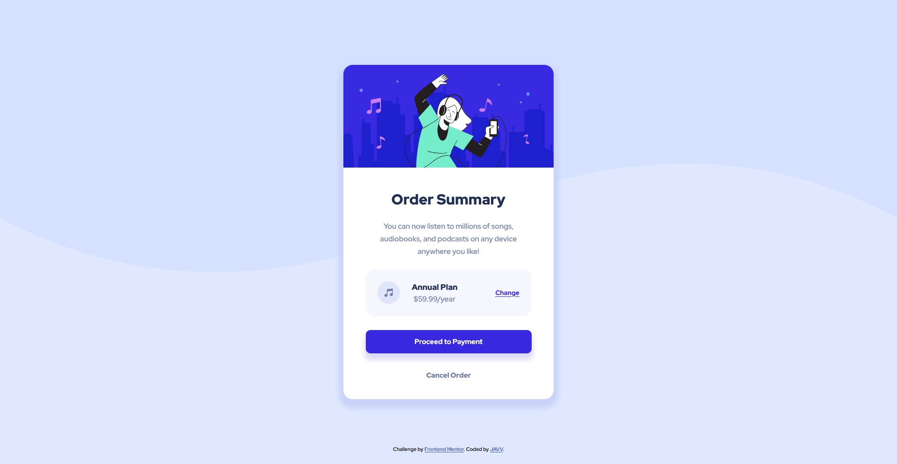

# Order Summary Card Solution - Frontend Mentor

Hello everyone, welcome to my repository 😁! 

This is my solution to the [Order summary card challenge on Frontend Mentor](https://www.frontendmentor.io/challenges/order-summary-component-QlPmajDUj).

## Table of contents

- [Overview](#overview)
  - [The challenge](#the-challenge)
  - [Screenshot](#screenshot)
  - [Links](#links)
- [My process](#my-process)
  - [Built with](#built-with)
  - [What I learned](#what-i-learned)
- [Author](#author)

## Overview

### The challenge

Users should be able to:

- See hover states for interactive elements

### Screenshot




### Links

- Solution URL: [Github](https://github.com/daisukeeita/Order-Summary-Component)
- Live Site URL: [Order Summary Component](https://daisukeeita.github.io/Order-Summary-Component/)

### Built with

- Semantic HTML5 markup
- CSS custom properties
- Flexbox
- CSS Grid
- Mobile-first workflow

### What I learned

What I learned in this challenge is the manipulation of background using `svg`. Background properties doesn't have to be inserted in CSS as it will destroy the original design proposal of the challenge. It made me stuck for a while due to the placement of the `svg` itself.

```css
body {
    display:         flex;
    flex-direction:  column;
    justify-content: center;
    align-items:     center;
    min-height:      100vh;
    text-rendering:  optimizeSpeed;
    line-height:     1.5;
    font-family: var(--font-family-redHatDisplay);
    background-color: var(--primary-color-300);
    background-image: url(images/pattern-background-mobile.svg);
    background-repeat: no-repeat;
    background-size: contain;
}
```

```css
body {
        background-image: url(images/pattern-background-desktop.svg);
        background-color: var(--primary-color-300);
        background-repeat: no-repeat;
        background-size: contain;
    }
```

As you can see, `background-repeat` and `background-size` was used to manipulate the position of the `svg`, It was enough to put the `svg` in the preferable postion.

At first I automatically used the `background-position: center` due to thinking that it will automatically put the `svg` in the preferred position, but that only destroyed the design proposal of the challenge.

## Author

- Frontend Mentor - [@daisukeeita](https://www.frontendmentor.io/profile/daisukeeita)